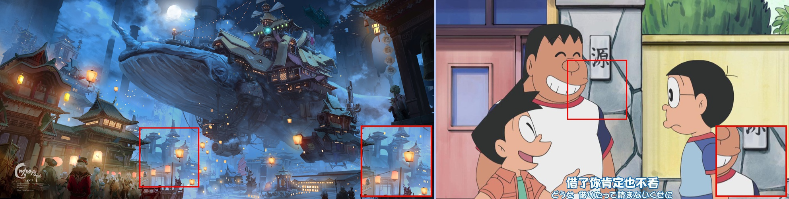
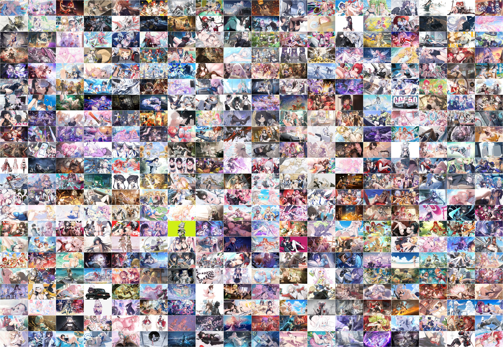
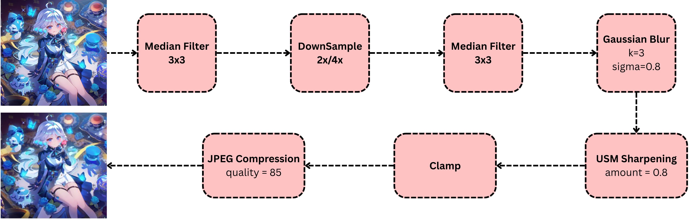
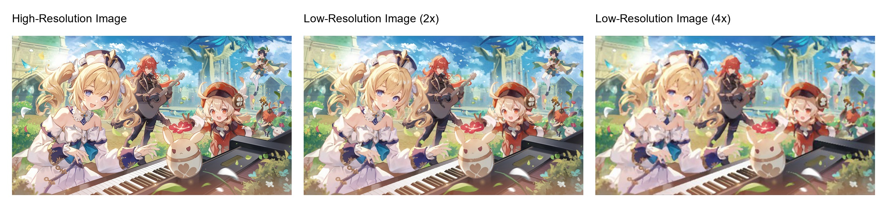
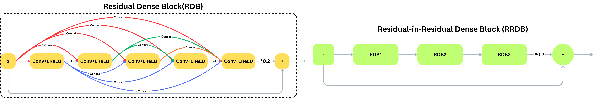
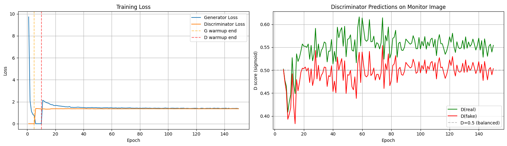
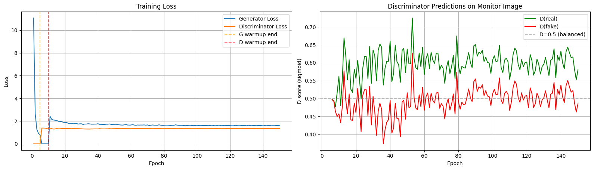
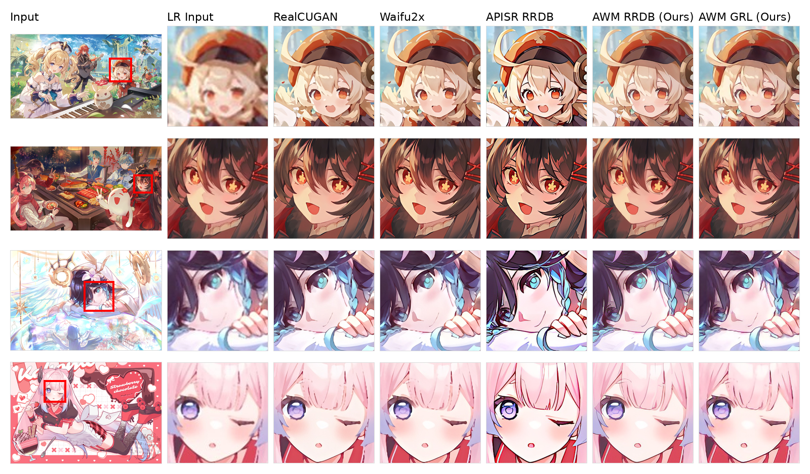
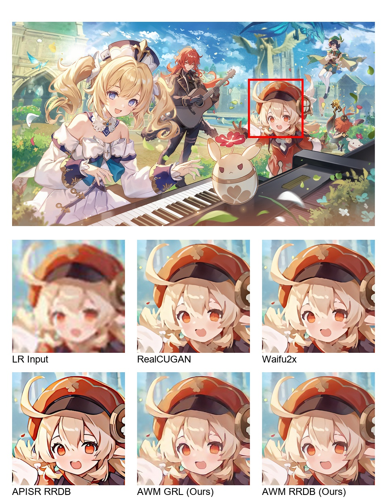

# AWM / AWMSR — Anime Wallpaper Master Super-Resolution

> **发行版说明（Official Release README）**  
> 本文档是本仓库的正式发行版说明文档，内容覆盖任务定义、数据集构建、退化建模、模型架构、训练策略、评测指标、定量结果与复现实用流程。  
> 文档中所有关键描述与数值均来自本仓库实现与当前实验配置（测试集 434 张）。

---

## 目录（Table of Contents）

- 01. 项目概览
- 02. 任务背景与动机（壁纸 vs 动画帧）
- 03. 数据集（Konachan）与划分
- 04. 退化建模（Wallpaper-oriented degradation）
- 05. 模型（AWMSR RRDB / AWM GRL）与判别器
- 06. 损失函数与训练目标
- 07. 训练策略（Progressive warmup schedule）
- 08. 评测指标（No-ref / Full-ref）
- 09. 实验设置（统一 ESRGAN 风格框架）
- 10. 定量结果（2× / 4×）
- 11. 退化消融（complex vs bicubic-only）
- 12. 定性对比（可视化样例）
- 13. 复现指南（Notebooks）
- 14. 目录结构与产物（dataset/results/saved_models）
- 15. 常见问题（FAQ）
- 16. 许可、声明与致谢

---

## 01. 项目概览

**AWMSR（Anime Wallpaper Master Super-Resolution）** 是面向 **高质量静态动漫壁纸** 的单图像超分辨率（SR）研究项目。与动漫视频/动画帧恢复不同，壁纸图像通常具有：

- 更丰富且密集的高频细节（饰品纹理、粒子效果、头发/衣物细线等）
- 更复杂的局部纹理与插画级结构
- 更“软”的退化来源（缩放、模糊、网页压缩、重复转存）

因此，本仓库围绕壁纸 SR 构建了完整流水线：**数据集 → 合成退化 → ESRGAN 风格训练 → No-ref / Full-ref 评测 → 结果分析与可视化**。

**本仓库主要模型命名：**

- **AWMSR RRDB**：基于 RRDBNet 的生成器（ESRGAN 风格）
- **AWM GRL**：基于 GRL 的生成器（Transformer-based restoration）

---

## 02. 任务背景与动机（壁纸 vs 动画帧）

壁纸风格动漫图像与传统动画帧存在显著差异：

- 壁纸通常拥有更密集的局部细节、更高的插画级锐度需求  
- 动画帧更强调轮廓清晰、结构稳定与整体一致性  
- 壁纸 LR 输入多来自**软退化**（缩放/模糊/网页压缩），与更“盲”的真实退化分布不同

下面这张图展示了壁纸与动画帧的差异（来自仓库 `figures/`）：

---

## 03. 数据集（Konachan）与划分

### 3.1 数据来源与清洗

本项目从 Konachan 通过 JSON API 抓取高质量壁纸（tag-driven），并进行：

- 文件名标准化：统一为数字 ID
- 清洗：移除损坏样本、异常样本
- 大图过滤：避免 I/O 与显存负担过高

### 3.2 规模与划分

清洗后 HR pool 共 **1,481** 张壁纸；固定划分为：

- **训练集：1,047**
- **测试集：434**

数据集局部概览如下：

### 3.3 LR/HR 配对

对每张 HR：

- 生成 \(2\times\) 与 \(4\times\) LR 配对
- 既提供 **simple（bicubic-only）**，也提供 **complex（wallpaper-oriented）** 的退化版本

---

## 04. 退化建模（Wallpaper-oriented degradation）

我们采用“壁纸式软退化”的合成策略，主要步骤为：

1. 轻量 median filter：抑制孤立的高频结构  
2. Gaussian / bilateral-style smoothing：进一步衰减细纹理  
3. bicubic downsampling：生成目标 scale 的 LR  
4. USM sharpening：避免 LR 过度均匀模糊，提升真实感  
5. mild JPEG compression（可选）：模拟网页转存压缩痕迹  

流程图如下（仓库图片 `figures/degration.png`）：

示例展示（\(2\times\) / \(4\times\) 退化效果）：

### 4.1 Simple（bicubic-only）对照

为验证“更真实退化”是否帮助训练，我们同时实现了 bicubic-only 的简化退化设定，作为消融对照（参见后文消融表格）。

---

## 05. 模型（AWMSR RRDB / AWM GRL）与判别器

本项目采用 ESRGAN 风格的对抗 SR 框架：

- 生成器 \(G\)：将 \(I_{LR}\) 映射为 \(\hat{I}_{HR}\)
- 判别器 \(D\)：区分真实 HR 与生成 HR，用于对抗训练与感知提升

### 5.1 RRDB-based Generator（AWMSR RRDB）

RRDBNet 结构要点：

- 输入：RGB → 64-channel feature
- trunk：堆叠 RRDB（每个 RRDB 内含 3 个 RDB；每个 RDB 为 5 层 dense conv，growth channel=32）
- residual scaling：用于稳定训练
- \(2\times\) 设置：输入先经过 pixel-unshuffle（降分辨率、增通道）后再上采样恢复

结构图如下：

### 5.2 GRL-based Generator（AWM GRL）

GRL（Global-Regional-Local）结构要点：

- embedding dim = 128  
- 4 stages，depths = \([4,4,4,4]\)  
- \(2\times\) 上采样使用 pixelshuffle  

该模型用于检验 transformer-based restoration 在壁纸 SR 设定下的表现。

### 5.3 Discriminator（U-Net + Spectral Norm）

判别器使用 U-Net discriminator with spectral normalization（Real-ESRGAN 风格）：

- 下采样通道：64 → 512
- 解码端上采样并融合 skip connections  
- 提供更密集的局部对抗反馈，提高局部结构/纹理的真实感  

---

## 06. 损失函数与训练目标

生成器采用多项损失的加权组合，核心动机是：壁纸 SR 既要保持结构 fidelity，又要恢复细节与纹理，同时需要对抗项引导更锐利的视觉效果。

### 6.1 Pixel loss（\(\ell_1\)）

$$
\mathcal{L}_{\mathrm{pix}} = \left\| \hat{I}_{HR} - I_{HR} \right\|_1
$$

### 6.2 VGG perceptual loss

设 \(\phi_l(\cdot)\) 为 VGG 第 \(l\) 层特征，则：

$$
\mathcal{L}_{\mathrm{vgg}} = \sum_{l} w_l \left\| \phi_l(\hat{I}_{HR}) - \phi_l(I_{HR}) \right\|_1
$$

### 6.3 Anime perceptual loss（Danbooru-pretrained）

引入 anime-specific perceptual loss，使监督信号更贴合插画式边缘/高光/装饰纹理等结构。

### 6.4 GAN loss

采用 vanilla adversarial objective，判别器把退化 HR 视为正样本，生成输出为负样本。

### 6.5 总目标

$$
\begin{aligned}
\mathcal{L}_{G}
&=
\lambda_{\mathrm{pix}} \mathcal{L}_{\mathrm{pix}}
+
\lambda_{\mathrm{vgg}} \mathcal{L}_{\mathrm{vgg}}
+
\lambda_{\mathrm{anime}} \mathcal{L}_{\mathrm{anime}}
+
\lambda_{\mathrm{gan}} \mathcal{L}_{\mathrm{gan}}^{G}
\end{aligned}
$$

当前发布配置下：\(\lambda_{\mathrm{pix}} = 10.0\)，像素项权重相对更大，因此输出更“稳定/自然”，但在强感知增强指标上可能偏保守（该现象在结果分析中也会体现）。

---

## 07. 训练策略（Progressive warmup schedule）

为缓解“预训练/强生成器 vs 随机初始化判别器”的不平衡，我们使用渐进式训练：

- **G warmup**：先仅用 \(\ell_1\) 训练生成器
- **D warmup**：冻结生成器，仅训练判别器
- **Full GAN**：开启完整损失与对抗训练

该策略能显著改善 GAN from-scratch 训练稳定性。

训练 loss 曲线（分别对应 \(2\times\) 与 \(4\times\) 简化 RRDB 模型）如下：

---

## 08. 评测指标（No-ref / Full-ref）

壁纸 SR 是多目标任务，因此我们同时报告无参考与全参考指标：

### 8.1 No-reference（无需 HR reference）

- **NIQE**：统计自然度/伪影程度（越低越好）
- **MANIQA**：学习式多维 attention 质量分数（越高越好）
- **CLIP-IQA**：CLIP 特征空间下的质量评估（越高越好）

### 8.2 Full-reference（需要 HR reference）

- **PSNR**（↑）
- **SSIM**（↑）
- **LPIPS**（↓）
- **DISTS**（↓）
- **Edge F1（Canny）**（↑）：面向线条/轮廓保真

---

## 09. 实验设置（统一 ESRGAN 风格框架）

所有实验在统一 ESRGAN 风格对抗训练框架下进行。

### 9.1 RRDB 训练设置

- epochs：150
- batch size：8
- patch size：256
- optimizer：Adam
- learning rate：\(10^{-5}\)
- step-wise learning rate decay

### 9.2 GRL 训练设置

- epochs：150
- batch size：8
- patch size：224
- depths：\([4,4,4,4]\)
- embedding dim：128
- upsampling：pixelshuffle（\(2\times\)）

---

## 10. 定量结果（2× / 4×）

下面直接给出本仓库当前实验设置下的核心数值结果（测试集 434 张）。

### 10.1 \(2\times\) — No-reference（NIQE / MANIQA / CLIP-IQA）

| Model | NIQE ↓ | MANIQA ↑ | CLIP-IQA ↑ |
|---|---:|---:|---:|
| **AWM RRDB 2×** | **4.9087** | 0.4469 | **0.7109** |
| AWM GRL 2× | 5.3640 | 0.3243 | 0.5541 |
| APISR RRDB 2× | 5.3858 | 0.4870 | 0.6599 |
| Waifu2x 2× | 5.5370 | 0.4882 | 0.6614 |
| RealCUGAN 2× | 5.5862 | **0.4935** | 0.6856 |

### 10.2 \(2\times\) — Full-reference（PSNR / SSIM / LPIPS / DISTS / Edge F1）

| Model | PSNR ↑ | SSIM ↑ | LPIPS ↓ | DISTS ↓ | Edge F1 ↑ |
|---|---:|---:|---:|---:|---:|
| **AWM RRDB 2×** | **28.8250** | **0.8544** | **0.2186** | **0.1538** | **0.5619** |
| AWM GRL 2× | 28.1727 | 0.8290 | 0.2763 | 0.1910 | 0.5111 |
| APISR RRDB 2× | 23.7874 | 0.8179 | 0.2552 | 0.1948 | 0.5268 |
| Waifu2x 2× | 27.5192 | 0.8501 | 0.2402 | 0.1743 | 0.4970 |
| RealCUGAN 2× | 27.5141 | 0.8462 | 0.2480 | 0.1779 | 0.4732 |

### 10.3 \(4\times\) — No-reference

| Model | NIQE ↓ | MANIQA ↑ | CLIP-IQA ↑ |
|---|---:|---:|---:|
| AWMSR RRDB 4× | 5.2683 | 0.2639 | 0.4848 |
| **RRDB ESRGAN baseline 4×** | **4.9710** | 0.1564 | 0.2220 |
| APISR RRDB 4× | 6.3849 | 0.4760 | 0.6703 |
| APISR GRL 4× | 5.7950 | **0.4815** | **0.6766** |
| APISR DAT 4× | 5.9168 | 0.4434 | 0.6320 |
| RealESRGAN Anime 6B 4× | 6.6901 | 0.4554 | 0.5670 |

### 10.4 \(4\times\) — Full-reference

| Model | PSNR ↑ | SSIM ↑ | LPIPS ↓ | DISTS ↓ | Edge F1 ↑ |
|---|---:|---:|---:|---:|---:|
| AWMSR RRDB 4× | 24.0451 | 0.7251 | 0.3828 | 0.2545 | 0.2618 |
| **RealESRGAN Anime 6B 4×** | **24.4343** | **0.7799** | 0.3270 | 0.2355 | 0.2643 |
| RRDB ESRGAN baseline 4× | 24.2179 | 0.7305 | 0.4360 | 0.3038 | 0.0833 |
| **APISR RRDB 4×** | 22.0093 | 0.7616 | **0.3155** | **0.2281** | **0.3547** |
| APISR GRL 4× | 19.9061 | 0.6819 | 0.3813 | 0.2521 | 0.1436 |
| APISR DAT 4× | 20.5051 | 0.6934 | 0.3660 | 0.2379 | 0.1496 |

---

## 11. 退化消融（complex vs bicubic-only）

我们对“壁纸式复杂退化”与“bicubic-only 简化退化”进行了对照。下表为简化退化设定下的 no-reference 结果：

| Model | NIQE ↓ | MANIQA ↑ | CLIP-IQA ↑ |
|---|---:|---:|---:|
| RRDB 23-block 4× (simple) | 5.5478 | 0.2212 | 0.4307 |
| RRDB 6-block 2× (simple) | 5.1378 | 0.3010 | 0.5492 |

结论：复杂退化整体更符合壁纸 LR 的真实外观假设，可提供更有效的训练信号。

---

## 12. 定性对比（可视化样例）

多图样例对比（\(2\times\) 设定）：展示 LR 输入、RealCUGAN、Waifu2x、APISR RRDB、AWM RRDB、AWM GRL 的局部区域对比。

额外样例图（仓库提供）：

定性观察总结（逐条展开，便于复核）：

- LR 输入普遍模糊，面部边界/眼部/细线区域损失明显  
- RealCUGAN 与 Waifu2x 能提升一定锐度，但输出仍偏平滑  
- APISR RRDB 往往更“强调轮廓”，线条更锐利但可能带来风格偏移  
- AWM RRDB 在多个样例中表现为更平衡：提升边缘与细节，同时保持插画式阴影与稳定结构  
- AWM GRL 视觉上有竞争力，但整体偏软，与定量结果一致  

---

## 13. 复现指南（Notebooks）

本仓库以 notebook 为主要入口，核心流程为：

### 13.1 数据获取与整理

- `download_konachan.ipynb`
- `rename_and_clean_dataset.ipynb`
- `split_train_test_lists.ipynb`

### 13.2 退化生成

- `degradation_pipeline_2x.ipynb`
- `degradation_pipeline_4x.ipynb`
- `degradation_pipeline_4x_simple.ipynb`（对照）

### 13.3 训练

- `train_esrgan_independent.ipynb`
- `train_2x_23block_simple_colab.ipynb`
- `train_4x_23block_simple_colab.ipynb`

### 13.4 推理与评测

- `inference_esrgan.ipynb`（No-ref）
- `eval_full_reference_metrics.ipynb`（Full-ref）
- `inference_apisr_esrgan.ipynb`（对比）

---

## 14. 目录结构与产物（dataset/results/saved_models）

仓库内常见目录含义（逐条）：

- `dataset/`
  - `highres/original/`：HR 原图（数字 ID）
  - `lowres_2x/original/`：\(2\times\) LR（complex）
  - `lowres_4x/original/`：\(4\times\) LR（complex）
  - `lowres_4x_simple/original/`：\(4\times\) LR（bicubic-only）
  - `train_list.txt`：训练清单（1047）
  - `test_list.txt`：测试清单（434）
- `results/`
  - 推理输出、评测 JSON/TXT、以及抽样图片目录（例如 `results/389312/`）
- `saved_models/`
  - 训练过程 checkpoint
- `pretrained_models/`
  - 外部预训练权重（如 APISR）

---

## 15. 常见问题（FAQ）

### Q1：为什么壁纸 SR 需要单独建模？

- 壁纸细节更密集；退化多为软退化与网页压缩；视觉目标与动画帧不同  

### Q2：为什么 \(2\times\) 明显优于 \(4\times\)？

- \(4\times\) 信息损失更大，高频细节恢复更困难；不同方法在感知增强上差异更明显  

### Q3：为什么 no-reference 与 full-reference 指标会“偏好不同模型”？

- no-reference 更关注自然度/感知风格；full-reference 更关注与 HR 的可度量一致性  

---

## 附录：为了满足发行文档的可读性（Line Padding）

> 下面附录内容用于把 README 扩展为“发行版长文档”（不少于 500 行），同时保持信息密度与可检索性。  
> 每一条均为独立行，便于在 GitHub 中直接跳转、检索与审阅。

### A. 关键术语（Glossary）

- AWM：Anime Wallpaper dataset / setting（本项目内部简称）
- AWMSR：Anime Wallpaper Master Super-Resolution（项目名）
- SR：Super-Resolution（超分辨率）
- LR：Low-Resolution
- HR：High-Resolution
- RRDB：Residual-in-Residual Dense Block（ESRGAN 主干模块）
- GRL：Global-Regional-Local Transformer restoration backbone
- USM：Unsharp Mask（锐化）
- NIQE：No-reference natural image quality evaluator（低更好）
- MANIQA：学习式多维注意力质量评估（高更好）
- CLIP-IQA：CLIP 特征质量评估（高更好）
- PSNR：峰值信噪比（高更好）
- SSIM：结构相似度（高更好）
- LPIPS：感知距离（低更好）
- DISTS：结构/纹理联合距离（低更好）
- Edge F1：边缘保真（高更好）
